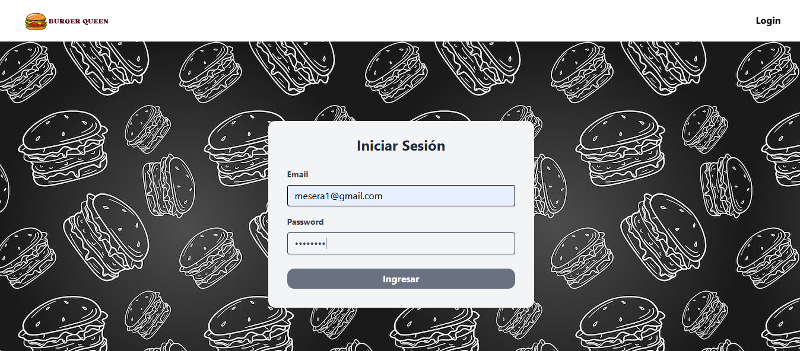

# Burger Queen

Proyecto de Laboratoria que consiste en una aplicación de pedidos de un restaurante.

### Login
Se loguean los meseros o los jefes de cocina.


### Opciones
Pueden elegir entre 2 opciones: Ingresar Pedido o Ver los pedidos.


### Home
Luego de escribir el nombre del cliente, puede elegir las comidas (desayuno, almuerzo o cena), y puede ver de manera automática como se va calculando los precios.


### Pedido
En la opción ver los pedidos puede ver todos los pedidos en una vista kanban según sus estados, y puede mover las cards (drag and drop), logré implementar esta funcionalidad con la librería [dnd-kit](https://dndkit.com/) y también tiene alertas con [sweetalert2](https://sweetalert2.github.io/).


### 🛠️ Tecnologías
- [React](https://react.dev)
- [TailwindCSS 4.0](https://tailwindcss.com)

### 🔧 Instalación

Clona el repositorio
```sh
git clone git@github.com:vmarialuzm/frontend_burger_api_client.git
```

Ingresar a la carpeta
```sh
cd frontend_burger_api_client
```

Instala las dependencias
```sh
npm install
```

Inicia el proyecto en modo desarrollo
```sh
npm run dev
```


